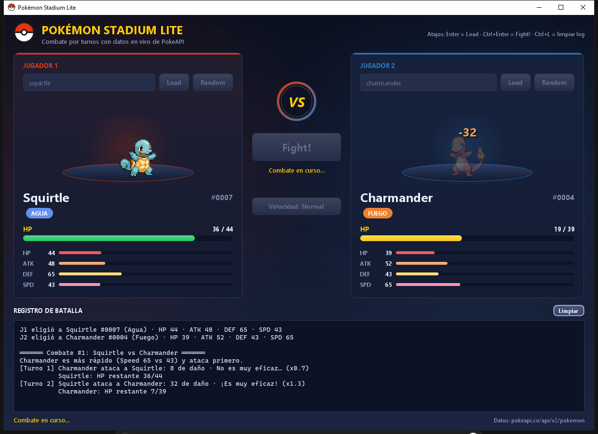
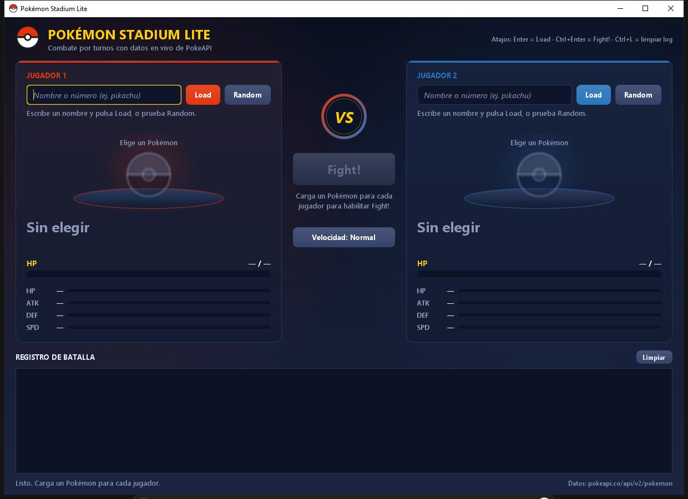
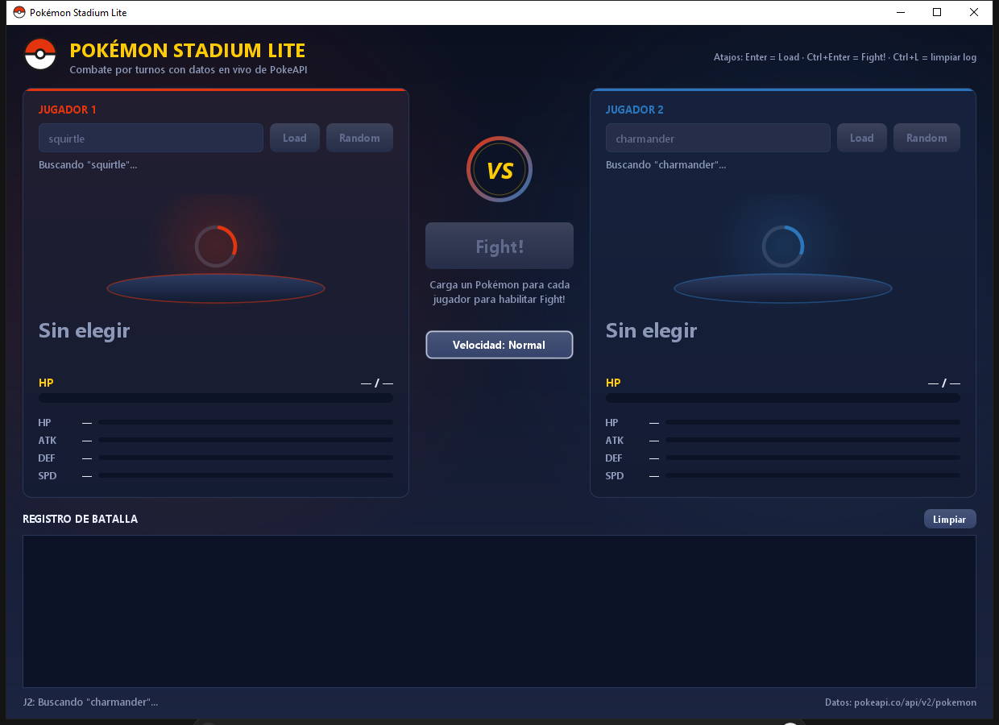
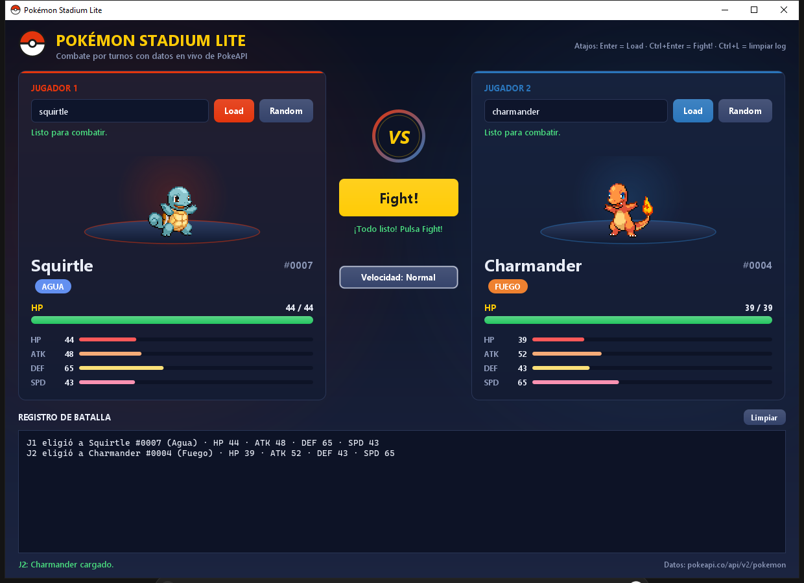
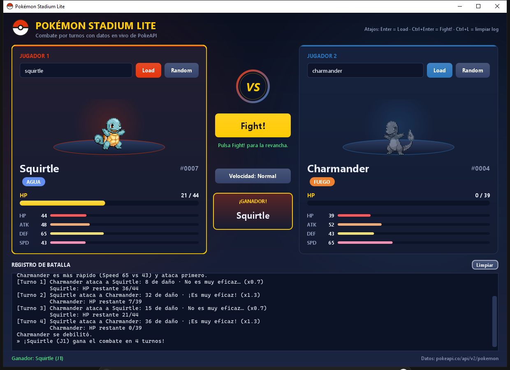
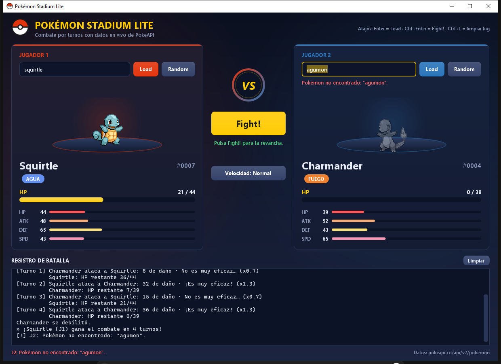
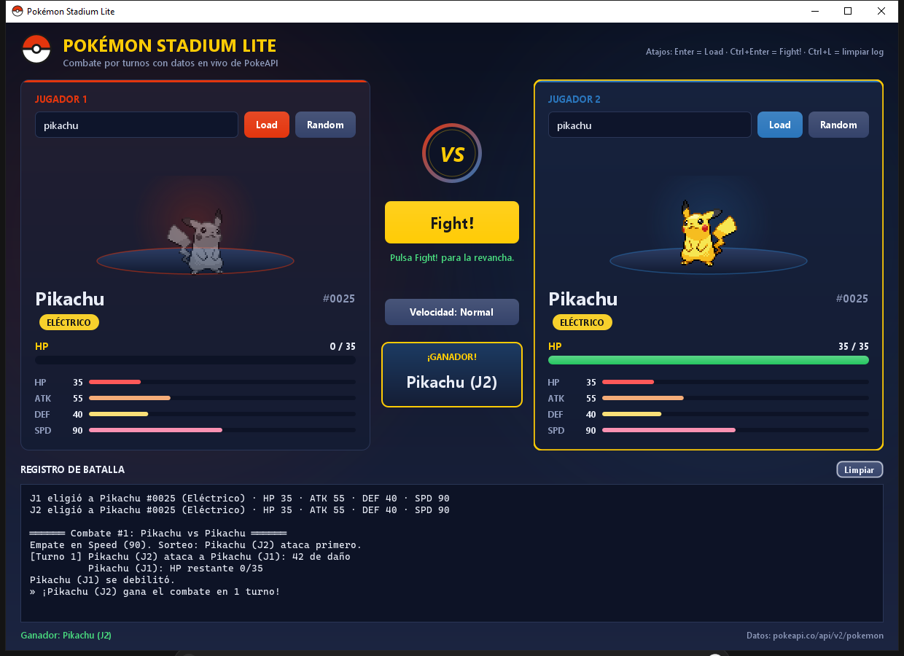

# Pokémon Stadium Lite

Aplicación de escritorio en **Java Swing** que simula un combate por turnos estilo Pokémon Stadium entre dos Pokémon obtenidos en vivo desde [PokeAPI](https://pokeapi.co/).

- **Programa:** Ingeniería en Sistemas
- **Materia:** Desarrollo de Software III
- **Docente:** Mg(c). Juan Pablo Pinillos Reina

## Integrantes

- Bryan Steven Panesso Avila
- Andres Felipe Castrillon



## Funcionalidades

**Requisitos del enunciado**

- Selección de Pokémon para 2 jugadores: por nombre (campo de texto + **Load**) o aleatorio (**Random**).
- Vista de cada Pokémon: sprite frontal, nombre, tipos y stats (HP, Attack, Defense, Speed), con barra de HP actual.
- Combate por turnos con **Fight!**: empieza el de mayor Speed (si empatan, se sortea), daño por turno, crítico, efectividad de tipos, HP que nunca baja de 0 y anuncio del ganador.
- Log de batalla desplazable (`JTextArea` + `JScrollPane`) con turno, atacante, defensor, daño, crítico, efectividad y HP restante.
- Errores visibles sin congelar la interfaz: "Pokémon no encontrado", "Error de red", nombre inválido, respuesta inválida.
- **Fight!** deshabilitado hasta que ambos Pokémon estén cargados correctamente.

**Mejoras adicionales**

- Interfaz oscura propia, dibujada con Java2D: tarjetas por jugador con su color, insignias de tipo con nombres en español y barras de stats.
- Barra de HP animada que cambia de color (verde, amarillo, rojo).
- Animaciones de combate: embestida al atacar, parpadeo al recibir daño, números de daño flotantes y Pokémon debilitado en gris.
- Sprites en pixel art escalados sin desenfoque y enfrentados (el del jugador 1 se voltea horizontalmente).
- Cartel de ganador y botón de revancha.
- Velocidad del combate configurable: Normal, Rápida o Lenta.
- Carga independiente por jugador con indicador de progreso; los dos Pokémon se pueden buscar al mismo tiempo.
- Entrada tolerante: `Mr Mime` → `mr-mime`, `Flabébé` → `flabebe`. También acepta el número de la Pokédex.
- Caché en memoria de Pokémon y sprites: repetir una búsqueda no vuelve a llamar a la API.
- Si ambos jugadores eligen el mismo Pokémon, se distinguen como `Pikachu (J1)` y `Pikachu (J2)`.
- Atajos de teclado: Enter = Load, Ctrl+Enter = Fight!, Ctrl+L = limpiar el log.
- 44 pruebas unitarias con JUnit 5.

## Requisitos

- **JDK 11 o superior** (probado con JDK 17).
- Conexión a internet.
- Maven 3.6+ es opcional: IntelliJ IDEA ya trae uno integrado y también se puede ejecutar sin Maven.

## Ejecución

### Opción 1: IntelliJ IDEA (recomendada)

1. `File > Open...` y seleccionar la carpeta del proyecto. IntelliJ detecta el `pom.xml` y descarga las dependencias.
2. Ejecutar la clase `stadium.App` (`src/main/java/stadium/App.java`).

### Opción 2: Maven

```powershell
mvn package                                   # compila, ejecuta las pruebas y genera el JAR
java -jar target/pokemon-stadium-lite.jar     # JAR ejecutable con org.json incluido
```

También se puede usar `mvn compile exec:java` para ejecutar directamente o `mvn test` para correr solo las pruebas.

### Opción 3: Sin Maven (Windows)

Doble clic en `run.bat`, o desde la terminal:

```powershell
.\run.bat
```

El script compila con `javac` usando `lib/json-20230227.jar` y lanza la aplicación.

## Estructura

```
src/main/java/stadium/
├── App.java                     # Punto de entrada: crea la ventana en el EDT
├── model/
│   └── Pokemon.java             # Modelo: stats, tipos, sprite y HP actual
├── api/
│   ├── PokeApiClient.java       # HttpClient + parseo JSON (org.json) + caché
│   └── PokeApiException.java    # Error con tipo: NOT_FOUND, NETWORK, INVALID_INPUT, BAD_RESPONSE
├── battle/
│   ├── Battle.java              # Reglas del combate (turnos, daño, crítico, efectividad)
│   ├── BattleListener.java      # Eventos: onTurn, onHpChanged, onBattleEnded (+ onBattleStarted)
│   └── TypeChart.java           # Agua > Fuego > Planta > Agua
└── ui/
    ├── BattleFrame.java         # Ventana principal: listeners, SwingWorkers y eventos del combate
    ├── EdtBattleListener.java   # Decorador que reenvía los eventos al EDT
    ├── PokemonCard.java         # Tarjeta de cada jugador
    ├── SpriteView.java          # Sprite con animaciones
    ├── HpBar.java, StatBar.java, TypeBadge.java, WinnerBanner.java, VsBadge.java
    └── Theme.java, StadiumButton.java, PlaceholderTextField.java, MessageView.java, ...
src/test/java/stadium/           # Pruebas unitarias (combate, modelo, parseo de la API)
```

## Diseño

El proyecto separa responsabilidades en cuatro paquetes. `model.Pokemon` guarda los datos de la API y el HP actual, que nunca baja de 0. `api.PokeApiClient` consulta `https://pokeapi.co/api/v2/pokemon/{name}` con `java.net.http.HttpClient`, parsea el JSON con `org.json` y convierte cada fallo en una `PokeApiException` con un mensaje listo para mostrar (404 → "Pokémon no encontrado", fallos de conexión o timeout → "Error de red"). `battle.Battle` contiene solo las reglas y no conoce Swing: todo lo que ocurre lo comunica mediante la interfaz propia `BattleListener` (`onTurn`, `onHpChanged`, `onBattleEnded`). Así la lógica se puede probar sin interfaz, como lo hacen las pruebas unitarias. La pieza "Battle (UI + reglas)" del enunciado queda repartida entre `battle.Battle` (reglas) y `ui.BattleFrame` (UI).

`ui.BattleFrame` registra los `ActionListener` de **Load**, **Random** y **Fight!**. Cada petición HTTP y el combate (que hace pausas entre turnos) corren en un `SwingWorker`, fuera del Event Dispatch Thread, así que la interfaz nunca se congela. Los eventos del combate pasan por `EdtBattleListener`, un decorador que los reenvía al EDT con `SwingUtilities.invokeLater`. Durante el combate, la UI (barras de HP, animaciones, log y cartel de ganador) se actualiza **solo** a partir de esos eventos. Las animaciones usan `javax.swing.Timer`, que tampoco bloquea el EDT. Mientras hay una carga o un combate en curso se deshabilitan los controles que podrían dejar la app en un estado inconsistente.

## Reglas del combate

- **Orden de turnos:** empieza el de mayor Speed; si empatan, el inicio se sortea. Después se alternan.
- **Fórmula de daño elegida:**

  ```
  base = max(1, ATK × rand(0.85 – 1.15) − DEF × rand(0.35 – 0.60))
  daño = max(1, round(base × crítico × efectividad))
  ```

  Es una variante de la sugerida (`ATK × random(0-1) − DEF × random(0-1)`). Con factores entre 0 y 1, el daño sale muchas veces en 0 o negativo y el combate se estanca. Con los rangos acotados, el ataque pesa más que la defensa, hay variación entre turnos y el daño mínimo de 1 garantiza que el combate siempre termina.
- **Crítico:** 10 % de probabilidad, multiplicador ×1.5.
- **Efectividad simple (solo primer tipo):** Agua > Fuego, Fuego > Planta, Planta > Agua → ×1.3; la inversa → ×0.7; el resto → ×1.0.
- **HP** nunca es negativo. El combate termina cuando un HP llega a 0 y se anuncia el ganador.

## Capturas de pantalla

**Pantalla inicial:** Fight! deshabilitado hasta cargar ambos Pokémon.



**Carga en segundo plano:** cada jugador muestra su propio indicador y la interfaz sigue respondiendo.



**Ambos Pokémon listos**



**Combate en curso:** daño flotante, HP animado, efectividad de tipos y HP restante en el log.


**Ganador**



**Manejo de errores:** Pokémon inexistente, mostrado en la tarjeta, en el log y en la barra de estado.



**Mismo Pokémon en ambos lados**


